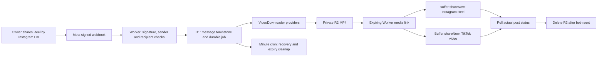

# Meme Autoposter

Share an authorized Instagram Reel to your meme page by DM. A Cloudflare Worker accepts only your approved personal Instagram sender, downloads the MP4, and creates immediate posts on your existing Instagram and TikTok Buffer channels.

## Current status

Deployed Worker: [meme-autoposter.meme-autoposter.workers.dev](https://meme-autoposter.meme-autoposter.workers.dev/health). Meta callback: `https://meme-autoposter.meme-autoposter.workers.dev/webhooks/instagram`. Remote health, Meta GET verification and protected admin access were verified on 2026-09-30. All 25 local tests and the GitHub checks passed.

The complete Worker, D1 migration, downloader interface, deployment tooling and automated tests are implemented. Real account posting requires the Worker secrets, Buffer channel discovery, Meta account subscription and a real authorized Reel test. A successful automated test or deployment does **not** prove that Meta can deliver a particular third-party Reel's video. Keep the Meta app in development mode; no App Review or app publication is needed for this stage.

## Architecture



The webhook commits jobs to D1 before acknowledging Meta. Work starts immediately with `waitUntil`. Cloudflare gives background HTTP work approximately 30 seconds; a minute cron recovers unfinished jobs through atomic leases. Short stages run consecutively when possible. Every Buffer create uses `mode: shareNow` and `schedulingType: automatic`. Buffer and the social networks still require time to ingest and process a video.

## Install, test and deploy

Use Node.js 24 and npm. Run commands from this project folder.

```powershell
npm ci
npm run check
npx wrangler login
npm run deploy
```

Deployment verifies the existing `meme-autoposter-media` bucket, creates or reuses the free-tier D1 database, applies migrations, deploys the Worker and records its real URL in `wrangler.jsonc`. It generates `ADMIN_TOKEN` and `META_VERIFY_TOKEN`, uploads them through Wrangler stdin, and stores local copies under ignored `.secrets/`. It never enables paid Cloudflare products or creates a public R2 bucket. `MEDIA` is bound to `meme-autoposter-media`; `DB` is bound to `meme-autoposter-jobs`.

The deployment script verifies `/health` and the Meta GET handshake remotely. The first deploy is deliberately unable to publish until secrets and account discovery are configured.

For a newly registered `workers.dev` subdomain, DNS/TLS provisioning may take a few minutes. Deployment verification retries automatically. `npm run verify:deployment` repeats the remote checks without redeploying or changing secrets.

## Meta dashboard: first external setup step

After deployment, the callback is the deployed Worker URL plus `/webhooks/instagram`. Copy the locally generated verification token without putting it in chat:

```powershell
Get-Content -Raw .secrets/meta-verify-token | Set-Clipboard
```

In your Meta app's **Manage messaging & content on Instagram** use case, open the Instagram Webhooks configuration. Set the callback URL, paste that verify token, and verify/save. Select the Instagram `messages` field. Keep the app in **Development**. Add/authorize your owned Instagram accounts as testers where required. Select Instagram API with Instagram Login: this project uses `graph.instagram.com` and an Instagram User access token, not a Facebook Page token.

Then securely enter the secrets:

```powershell
npx wrangler secret put BUFFER_API_KEY
npx wrangler secret put META_APP_SECRET
npx wrangler secret put META_ACCESS_TOKEN
npx wrangler secret put OWNER_IG_SENDER_ID
npm run setup
```

`META_ACCESS_TOKEN` should be the meme account's Instagram User access token with `instagram_business_basic` and `instagram_business_manage_messages`. Use the Instagram app secret associated with that token's app. The sender ID is the **Instagram-scoped sender ID in the actual inbound messaging webhook**, not a username, Buffer channel ID, or an arbitrary profile ID. It is checked as an exact match. Do not paste any secret into chat or commit it.

`npm run setup` queries Buffer organizations and channels automatically, selects exactly one Instagram and one TikTok channel, rejects disconnected/locked channels and TikTok reminder mode, verifies the Meta account matches the Instagram channel, and subscribes that account to `messages`. Multiple matching channels fail closed until the intended accounts are selected deliberately. No manual channel search is needed for the stated one-page-per-network setup. The Buffer key needs organization/channel read, post read and post write permissions.

`META_VERIFY_TOKEN` and `ADMIN_TOKEN` are already generated by deployment. `DOWNLOADER_API_KEY` is optional. `.dev.vars.example` contains secret **names only**; it is not a runnable dotenv file. For local development, create your own ignored `.dev.vars` using Wrangler's `NAME=value` syntax. Never use production keys in tests.

## Downloader providers and real-world limits

The `VideoDownloader` interface in `src/downloaders.ts` isolates video acquisition from publishing, storage and job tracking. Providers run in this order:

1. **Meta attachment:** Fetch the signed CDN URL for an explicitly identified `ig_reel`/`reel` share. No extra service or key.
2. **Meta Graph:** Fetch authorized media by its ID and require `VIDEO` plus `REELS`/a Reel permalink. Only works for media that the token can access.
3. **Public page:** For an actual `/reel/` URL, try published `og:video` or embedded `video_url` data. Zero cost, best effort. Does not log into Instagram or bypass access controls. Can be disabled with `ALLOW_PUBLIC_PAGE_DOWNLOADER=false`.
4. **Optional API:** An adapter for a downloader you choose later. No paid account is provisioned and no unsupported vendor endpoint is assumed.

Current Meta payloads may use `ig_post` for a shared post, with a media ID, title and signed CDN URL. A thumbnail or ambiguous share is **not** assumed to be a Reel. Graph metadata or the optional provider must identify it as a Reel. Legacy `share` payloads and dual attachments are also handled without duplicate jobs. A bare uploaded `video` or a story never triggers posting.

Meta does not guarantee downloadable video for arbitrary third-party shares, even with the author's permission. Public pages can block automated requests, and Graph permissions limit access to other accounts' media. If the real webhook contains only a thumbnail and an inaccessible ID, a provider or an actual Reel permalink will be required. The job records `no_downloader_could_resolve_reel` and publishes nothing. This must be checked using a real authorized Reel before declaring the DM workflow live.

To configure the optional API, put a **non-secret HTTPS endpoint** in `DOWNLOADER_API_URL`, and, if required, run:

```powershell
npx wrangler secret put DOWNLOADER_API_KEY
```

Our adapter sends `POST` JSON `{ "url": "optional Reel permalink", "mediaId": "optional Meta media ID", "attachmentUrl": "optional signed Meta CDN URL" }`, with `Authorization: Bearer ...` only if a key exists. The provider contract returns `{ "videoUrl": "https://trusted-cdn/video.mp4", "isReel": true }`. This is **our adapter contract**, not a claim about any commercial API. Implement a vendor-specific class if their contract differs. Additional trusted media domains can be configured with comma-separated `DOWNLOADER_MEDIA_HOSTS`; use exact domains you trust, not broad hosting suffixes. All redirects are validated. Secret-bearing API URLs are prohibited.

Downloads must return `video/mp4`, a correct `Content-Length`, and an MP4 `ftyp` header. The default maximum is **25 MiB**. The Worker streams through `FixedLengthStream` into R2 and aborts oversized or truncated responses. It does not transcode; Buffer/network codec, duration and aspect-ratio validation can still reject a real MP4.

## Duplicate protection and retry policy

The D1 job primary key is a SHA-256 hash of recipient plus Meta message ID. Permanent tombstones survive cleanup; the same message cannot create another job. Separate per-channel records are reserved atomically before Buffer is called. Webhook retries, concurrent requests, expired worker leases and a failure on one channel cannot resubmit the other channel.

Buffer's documented `CreatePostInput` has no idempotency key. Therefore this app provides **at-most-once creation per channel**, with an explicit uncertainty state. It cannot promise both automatic recovery from every possible network failure and mathematically exact once-only external posting. If Buffer might have accepted a mutation before a timeout or crash, that channel remains `unknown`/`submitting` and requires reconciliation. It is **never retried automatically**. This prioritizes your no-duplicates requirement. Definite mutation rejection is recorded as a failure; it does not requeue the content.

Read-only API requests and safe download stages retry with backoff. Post status polling runs every minute for the first ten minutes, then hourly to stay within Buffer's free API quota during a stuck upload. HTTP 429/5xx reads back off. Buffer acceptance is recorded independently for both channels; `completed` requires both posts' actual status to be `sent`.

## Private media and cleanup

R2 stays private. Buffer receives an HTTPS Worker URL with a random 256-bit bearer capability that expires after 24 hours. The Worker checks the D1 token and expiration on every GET/HEAD, supports byte ranges, uses `no-store`, and never redirects to public R2. Anyone possessing this temporary URL can fetch it until expiry; Buffer needs that access. Do not share it.

Once both posts are `sent`, the object is deleted and its URL revoked. Known failed posts with no remaining consumers are cleaned promptly. Uncertain or stuck jobs retain media only until the hard expiry. The minute cron deletes expired objects and moves expired jobs to `attention`; an hourly, paginated R2 sweep catches orphaned objects under `meme-autoposter/`. Other bucket prefixes are untouched. Private source URLs and captions are purged after terminal jobs age two days; small message hashes/post IDs remain for deduplication.

Cleanup requires cron to run. If the Worker is removed, disabled or its quota is exhausted, expired URLs still deny access while the Worker runs, but physical deletion can be delayed until cron resumes. The independent R2 bucket lifecycle safeguard described in `docs/operations.md` can remove objects even if the Worker is unavailable.

## Caption and owner confirmation

A deterministic generator selects short captions such as “had to share this” and adds `#fyp #memes #funny`. It uses no paid AI API, copies no untrusted source caption and does not pretend to understand video content.

Optional DM confirmation is off by default. Set `ENABLE_OWNER_DM=true` and redeploy after messaging access is verified. The Worker sends exactly `✅ Posted to Instagram + TikTok` only after both posts are actually sent and within the standard messaging window. Notification errors do not retry posts or undo completion.

## Operation and local tests

```powershell
npm run status
npx wrangler tail
npm run db:local
npm run dev
```

`GET /health` is public. `GET` and `POST /webhooks/instagram` perform verification and ingest signed DMs. `/media/<job-hash>.mp4` is capability protected. `POST /admin/setup` and `GET /admin/status` require `ADMIN_TOKEN`. The local admin CLI reads its ignored token automatically. Status returns fixed error codes and post IDs, never source URLs or secrets. Structured logs likewise contain hashes, provider names, fixed codes and post IDs only; request invocation logging is disabled to avoid logging temporary URL tokens.

`npm run check` runs ESLint, TypeScript and Vitest inside the actual Workers runtime with local D1/R2. Tests mock Meta/Buffer HTTP responses; they never post to your real channels. GitHub Actions repeats checks and the Wrangler bundle dry run. See `docs/testing.md` for live acceptance checks and `docs/api-contracts.md` for official API references.

## Cost

The design uses Workers Free, one D1 database and the existing R2 bucket, with no paid queue, browser rendering, AI API or video-transcoding service. At approximately one short video per day, normal requests/storage fit the published free allowances. A minute cron performs a small indexed D1 scan; R2 orphan listing is hourly, not every minute. Buffer's Free personal API currently allows 250 calls per 24 hours and 3,000 per rolling 30 days; normal usage is a few calls per meme. Free quotas are shared across your account and can change; existing subscriptions or an optional downloader may have their own costs. The deploy script never upgrades a plan.
