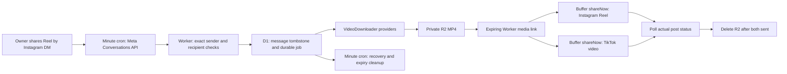

# Meme Autoposter

Share an authorized Instagram Reel to your meme page by DM. A Cloudflare Worker checks the approved conversation through Meta's API every minute, downloads the MP4, and creates immediate posts on your existing Instagram and TikTok Buffer channels. The app remains unpublished. Signed webhook ingestion is also implemented for a future authorized mode change.

## Current status

Deployed Worker: [meme-autoposter.meme-autoposter.workers.dev](https://meme-autoposter.meme-autoposter.workers.dev/health). Meta callback: `https://meme-autoposter.meme-autoposter.workers.dev/webhooks/instagram`. Remote health, Meta GET verification and protected admin access were verified on 2026-10-01. Local checks run lint, typechecking and Workers-runtime tests; GitHub Actions repeats the checks.

Public privacy policy: [Meme Autoposter Privacy Policy](https://meme-autoposter.meme-autoposter.workers.dev/privacy). Use this URL in Meta's Privacy Policy URL field. The page describes the app's current data processing, retention, service providers and how to contact the account owner about deletion.

The Worker, D1 migration, downloader interface, deployment tooling and automated tests are implemented. On 2026-10-01 the operator authorized API polling to preserve the DM workflow while keeping the app unpublished. Real account posting requires the Worker secrets, Buffer channel discovery, approved sender installation and a real authorized Reel test. A successful automated test or deployment does **not** prove that Meta exposes a particular third-party Reel's downloadable video. The project never publishes your Meta app or submits App Review.

Polling is deployed and active. Meta's API matched the existing setup DM from `@rebarfw` to the configured meme account; its sender ID was securely installed as a Worker secret and the temporary proof removed. The real native Reel test revealed a link-only `shares.data[].link` response. The parser handles that response and recovered the same DM as one durable job. Anonymous public Reel/post/embed requests returned HTML without video data. On 2026-10-01 the owner authorized multiple third-party website fallbacks. VideoDropper resolved that existing Reel locally to a direct Meta CDN MP4 URL without a key, but its API challenges requests from the deployed Worker. Worker probes also found FastDL returning no video, SaveFrom rejecting the anonymous request, and SnapInsta requiring a challenge. All four adapters are deployed and fail over safely; none is currently verified usable from Workers.

The real test Reel was successfully published on 2026-10-01. Guarded operator recovery resolved the same authorized Reel locally without sending credentials to the site, then the Worker downloaded its validated 742,341-byte MP4 into private R2 and created both immediate Buffer posts. Buffer subsequently reported both Instagram `@okbruhfiles` and TikTok `@viral.yt.video` as `sent`; the original job is `completed`. Remote R2 lookup confirmed the object no longer exists. Polling and a rejected recovery attempt retained the same single job and two post IDs. See `docs/testing.md` for evidence. **This local recovery does not establish fully autonomous downloads for future link-only DMs:** a usable Worker-compatible resolver is still required; the optional Apify provider is implemented but its secret is not installed.

## Architecture



With `INGEST_MODE=polling`, the minute cron requests conversations filtered by the exact approved Instagram-scoped sender ID, checks recent message IDs, and reads only unseen message details. It checks the sender and own recipient again before committing a job to D1. History before polling activation is excluded. Quiet polling uses two small Meta GETs per minute for the approved conversation, with up to six unseen detail reads per run; API errors trigger backoff. Atomic leases prevent concurrent polling and recover unfinished jobs. Every Buffer create uses `mode: shareNow` and `schedulingType: automatic`. Buffer and the social networks still require time to ingest and process a video.

With `INGEST_MODE=webhook`, the webhook commits jobs before acknowledging Meta and starts work immediately with `waitUntil`; the minute cron recovers interrupted work. Only one ingestion path is active. In polling mode, signed webhook samples are acknowledged without creating jobs. Switching ingestion mode does not reset permanent message tombstones.

Valid signed notifications that cannot trigger publishing, including dashboard samples and DMs before an owner is configured, receive HTTP 200 with zero jobs. An approved Reel received during a Buffer/configuration outage receives HTTP 503 so Meta can retry it after recovery. Missing or invalid signatures are always rejected.

## Install, test and deploy

Use Node.js 24 and npm. Run commands from this project folder.

```powershell
npm ci
npm run check
npx wrangler login
npm run deploy
```

Deployment verifies the existing `meme-autoposter-media` bucket, creates or reuses the free-tier D1 database, applies migrations, deploys the Worker and records its real URL in `wrangler.jsonc`. It generates `ADMIN_TOKEN` and `META_VERIFY_TOKEN`, uploads them through Wrangler stdin, and stores local copies under ignored `.secrets/`. It never enables paid Cloudflare products or creates a public R2 bucket. `MEDIA` is bound to `meme-autoposter-media`; `DB` is bound to `meme-autoposter-jobs`.

The deployment script verifies `/health` and the Meta GET handshake remotely. The first deploy is deliberately unable to publish until secrets and account discovery are configured.

For a newly registered `workers.dev` subdomain, DNS/TLS provisioning may take a few minutes. Deployment verification retries automatically. `npm run verify:deployment` repeats the remote checks without redeploying or changing secrets.

## Meta dashboard: first external setup step

After deployment, the callback is the deployed Worker URL plus `/webhooks/instagram`. Copy the locally generated verification token without putting it in chat:

```powershell
Get-Content -Raw .secrets/meta-verify-token | Set-Clipboard
```

In your Meta app's **Manage messaging & content on Instagram** use case, open the Instagram Webhooks configuration. Set the callback URL, paste that verify token, and verify/save. Select the Instagram `messages` field. Keep the app in **Development**. Add/authorize your owned Instagram accounts as testers where required. Select Instagram API with Instagram Login: this project uses `graph.instagram.com` and an Instagram User access token, not a Facebook Page token.

**Current delivery limitation:** on 2026-09-30 the actual Instagram Login dashboard explicitly required a published app to receive webhooks. Profile reads, Conversations API reads and account subscriptions succeeded while the app was unpublished; a real setup DM was readable through Meta's API but did not arrive at the Worker. On 2026-10-01 the dashboard's signed synthetic test passed HMAC validation and returned HTTP 200. The operator then explicitly authorized minute API polling. `INGEST_MODE=polling` uses the authorized Conversations API; it does not publish the app, submit App Review or change the account subscription.

Then securely enter the secrets:

```powershell
npx wrangler secret put BUFFER_API_KEY
npx wrangler secret put META_APP_SECRET
npx wrangler secret put META_ACCESS_TOKEN
npm run setup
npm run owner:start
```

Send the exact one-time message printed by `owner:start` **from your approved personal Instagram account** to the indicated meme page. In polling mode, run `npm run owner:import -- PERSONAL_USERNAME SETUP_DM_CODE` with that personal username and exact printed message. The authenticated importer checks Meta's API for the exact message, username and own recipient, then establishes a 15-minute setup proof. It can recover an already sent setup message from the past 48 hours; this does not extend the public webhook challenge's lifetime. In webhook mode, the signed incoming setup DM establishes the proof while the challenge is valid.

Then run `npm run owner:finish`: the authenticated installer reads the verified Instagram-scoped sender ID, uploads it as `OWNER_IG_SENDER_ID` through Wrangler standard input, and removes the temporary proof. It creates no new local secret file. The setup DM creates no publishing job. `npm run owner:status` checks the proof without printing the sender ID. A new `owner:start` invalidates the previous message; an already configured owner cannot be rebound through this flow. API verification proves an authenticated API read, not webhook delivery.

If no verified setup DM arrives, `npm run owner:diagnose` checks the pending code through Meta's documented Conversations/message reads. It returns only match/recipient/format booleans and counts, discards message contents and sender IDs, and never installs an owner. This distinguishes API-visible messages from actual signed webhook delivery.

`META_ACCESS_TOKEN` should be the meme account's Instagram User access token with `instagram_business_basic` and `instagram_business_manage_messages`. Use the Instagram app secret associated with that token's app. The sender ID is the **Instagram-scoped sender ID from the actual authorization DM**, not a username, Buffer channel ID, or an arbitrary profile ID. It is checked as an exact match. The setup flow discovers it from Meta's authenticated message API or signed webhook; you do not need to find it manually. Do not paste any API credential into chat or commit it.

If Ctrl+V in Wrangler's masked prompt stores a control character instead of pasting, copy the token and use PowerShell standard input: `Get-Clipboard -Raw | npx wrangler secret put META_ACCESS_TOKEN`. The command does not display the token. Never print clipboard contents or put a token directly in a shell command.

Use `npm run secrets:status` to check installed secret names safely. It prints configuration booleans and flags possible naming mistakes using recognized names only. It never prints an unexpected name, which could accidentally contain a pasted credential. Local files containing tokens and `*secret*.txt` files are gitignored.

To diagnose Instagram independently of Buffer, run `npm run meta:diagnose`. The protected Worker queries the profile, checks access to the Conversations API, and reads the account's subscribed apps. Successful profile and Conversations reads verify basic and messaging access through API authorization; they do not enumerate scope strings. Instagram Login rejects `/me/permissions`, and its user token cannot authorize the token-debugging endpoint. Failed access checks are reported as unknown with the actual Meta error, rather than as proof of a missing scope or App Review requirement. Conversation IDs and contents are never returned by the diagnostic. `npm run meta:subscribe` attempts the account-level `messages` subscription and reads it back, preserving fields already returned by Meta. It returns sanitized Meta error codes, subcodes and trace IDs, never access tokens, and does not change app mode, submit App Review, send messages or publish posts. A successful subscription request does not prove webhook delivery; test delivery separately.

`npm run setup` queries Buffer organizations and channels automatically, selects exactly one Instagram and one TikTok channel, rejects disconnected/locked channels and TikTok reminder mode, verifies the Meta account matches the Instagram channel, and subscribes that account to `messages`. Multiple matching channels fail closed until the intended accounts are selected deliberately. No manual channel search is needed for the stated one-page-per-network setup. The Buffer key needs organization/channel read, post read and post write permissions.

`META_VERIFY_TOKEN` and `ADMIN_TOKEN` are already generated by deployment. `DOWNLOADER_API_KEY` is optional. `.dev.vars.example` contains secret **names only**; it is not a runnable dotenv file. For local development, create your own ignored `.dev.vars` using Wrangler's `NAME=value` syntax. Never use production keys in tests.

## Downloader providers and real-world limits

The `VideoDownloader` interface in `src/downloaders.ts` isolates video acquisition from publishing, storage and job tracking. Providers run in this order:

1. **Meta attachment:** Fetch the signed CDN URL for an explicitly identified `ig_reel`/`reel` share. No extra service or key.
2. **Meta Graph:** Fetch authorized media by its ID and require `VIDEO` plus `REELS`/a Reel permalink. Only works for media that the token can access.
3. **Public page:** For an actual `/reel/` URL, try published `og:video` or embedded `video_url` data. Zero cost, best effort. Does not log into Instagram or bypass access controls. Can be disabled with `ALLOW_PUBLIC_PAGE_DOWNLOADER=false`.
4. **Optional API:** An adapter for a downloader you choose later. No paid account is provisioned and no unsupported vendor endpoint is assumed.
5. **Optional Apify:** `DOWNLOADER_PROVIDER=apify` selects Apify's maintained Instagram Reel Scraper once `DOWNLOADER_API_KEY` exists. It sends one canonical Reel URL, requests one result, verifies its exact shortcode, video and Reel type, then downloads only from trusted Meta CDN domains. The credential stays in the API authorization header. No transcript, paid share count or separately stored Apify video is requested. The adapter uses the actual documented Actor contract, separate from the generic API adapter above.
6. **Third-party website fallbacks:** isolated classes in `src/downloader-providers/` implement VideoDropper, FastDL, SaveFrom and SnapInsta. They run sequentially after the providers above. `THIRD_PARTY_DOWNLOADER_PROVIDERS=videodropper,fastdl,savefrom,snapinsta` enables and orders them; remove a name to disable that site or set an empty string to disable all. Duplicate names run once, unknown names fail closed. No website is essential to the app. Only a canonical, authorized Reel permalink is sent, never account credentials, private messages or cookies.

The adapters use the actual public website flows inspected on 2026-10-01, not advertised or invented stable API contracts. VideoDropper's site uses an encoded `url` header and returns original CDN video URLs. FastDL's anonymous unsigned fallback posts `target_url`; SaveFrom's worker receives its form fields and anonymous `{url}` fallback. Those two currently reject/challenge anonymous requests. SnapInsta currently requires Turnstile and is skipped; the adapter supports only its plain HTML result format if that becomes available. Each can be replaced independently. No remote result JavaScript is executed and no CAPTCHA is solved or bypassed. Changes to these unofficial formats can break a site even if its browser page still works.

A website attempt has a 15-second deadline (VideoDropper: 25 seconds), including redirects and media fetches. The whole downloader chain/upload has a 150-second deadline, within the job's lease. Metadata is capped at 256 KB. Direct Meta CDN MP4s are preferred; only the provider's observed, narrowly allowlisted proxy may be tried afterward. HTML/CAPTCHA responses, thumbnail/audio links, unsafe hosts/redirects, missing or oversized lengths, compressed media and fake MP4 signatures are rejected **before selecting the provider**, allowing automatic failover. R2 still verifies the full streamed length and enforces the size limit.

Instagram Login can return a native Reel with only `shares.data[].link`, omitting the generic Message reference's `url`, `id` and `type`. This was verified through the live API on 2026-10-01. A canonical `/reel/` link supplies Reel evidence; unrelated links, declared stories and ambiguous multiple shares remain rejected. Parser upgrades recheck recent cached message hashes while retaining permanent D1 job tombstones.

Current Meta payloads may use `ig_post` for a shared post, with a media ID, title and signed CDN URL. A thumbnail or ambiguous share is **not** assumed to be a Reel. Graph metadata or the optional provider must identify it as a Reel. Legacy `share` payloads and dual attachments are also handled without duplicate jobs. A bare uploaded `video` or a story never triggers posting.

Meta does not guarantee downloadable video for arbitrary third-party shares, even with the author's permission. Public pages can block automated requests, and Graph permissions limit access to other accounts' media. If the real message contains only a thumbnail and an inaccessible ID, a provider or an actual Reel permalink will be required. The job records `no_downloader_could_resolve_reel` and publishes nothing. This must be checked using a real authorized Reel before declaring the DM workflow live.

To configure the optional API, put a **non-secret HTTPS endpoint** in `DOWNLOADER_API_URL`, and, if required, run:

```powershell
npx wrangler secret put DOWNLOADER_API_KEY
```

Our adapter sends `POST` JSON `{ "url": "optional Reel permalink", "mediaId": "optional Meta media ID", "attachmentUrl": "optional signed Meta CDN URL" }`, with `Authorization: Bearer ...` only if a key exists. The provider contract returns `{ "videoUrl": "https://trusted-cdn/video.mp4", "isReel": true }`. This is **our adapter contract**, not a claim about any commercial API. Implement a vendor-specific class if their contract differs. Additional trusted media domains can be configured with comma-separated `DOWNLOADER_MEDIA_HOSTS`; use exact domains you trust, not broad hosting suffixes. All redirects are validated. Secret-bearing API URLs are prohibited.

For the implemented Apify provider, use an [Apify Free account](https://apify.com/pricing) and securely upload its API token as `DOWNLOADER_API_KEY`. Do not set `DOWNLOADER_API_URL`; the provider has a fixed official endpoint. The current Free plan includes $5 in monthly usage credits without a card. The adapter caps each Actor run at $0.05 of charges and atomically permits at most 40 runs per UTC calendar month, including failed attempts. Other account usage and storage also consume shared credits; the app never upgrades the plan. Exceeding the adapter's budget stops downloads. See [the Actor input](https://apify.com/apify/instagram-reel-scraper/input-schema), [output](https://apify.com/apify/instagram-reel-scraper/output-schema), and [API](https://apify.com/apify/instagram-reel-scraper/api) contracts. Access to private/restricted media is not promised.

Downloads must return `video/mp4`, a correct `Content-Length`, and an MP4 `ftyp` header. The default maximum is **25 MiB**. The Worker streams through `FixedLengthStream` into R2 and aborts oversized or truncated responses. It does not transcode; Buffer/network codec, duration and aspect-ratio validation can still reject a real MP4.

## Duplicate protection and retry policy

The D1 job primary key is a SHA-256 hash of recipient plus Meta message ID. Permanent tombstones survive cleanup; the same message cannot create another job. Separate per-channel records are reserved atomically before Buffer is called. Webhook retries, concurrent requests, expired worker leases and a failure on one channel cannot resubmit the other channel.

Buffer's documented `CreatePostInput` has no idempotency key. Therefore this app provides **at-most-once creation per channel**, with an explicit uncertainty state. It cannot promise both automatic recovery from every possible network failure and mathematically exact once-only external posting. If Buffer might have accepted a mutation before a timeout or crash, that channel remains `unknown`/`submitting` and requires reconciliation. It is **never retried automatically**. This prioritizes your no-duplicates requirement. Definite mutation rejection is recorded as a failure; it does not requeue the content.

Read-only API requests and safe download stages retry with backoff. Post status polling runs every minute for the first ten minutes, then hourly to stay within Buffer's free API quota during a stuck upload. HTTP 429/5xx reads back off. Buffer acceptance is recorded independently for both channels; `completed` requires both posts' actual status to be `sent`.

## Private media and cleanup

R2 stays private. Buffer receives an HTTPS Worker URL with a random 256-bit bearer capability that expires after 24 hours. The Worker checks the D1 token and expiration on every GET/HEAD, supports byte ranges, uses `no-store`, and never redirects to public R2. Anyone possessing this temporary URL can fetch it until expiry; Buffer needs that access. Do not share it.

Once both posts are `sent`, the object is deleted and its URL revoked. Known failed posts with no remaining consumers are cleaned promptly. Uncertain or stuck jobs retain media only until the hard expiry. The minute cron deletes expired objects and moves expired jobs to `attention`; an hourly, paginated R2 sweep catches orphaned objects under `meme-autoposter/`. Other bucket prefixes are untouched. Private source URLs and captions are purged after terminal jobs age two days; small message hashes/post IDs remain for deduplication.

Cleanup requires cron to run. If the Worker is removed, disabled or its quota is exhausted, expired URLs still deny access while the Worker runs, but physical deletion can be delayed until cron resumes. The independent R2 bucket lifecycle safeguard described in `docs/operations.md` can remove objects even if the Worker is unavailable.

## Caption and owner confirmation

A deterministic generator selects short captions such as “had to share this” and adds `#fyp #memes #funny`. It uses no paid AI API, copies no untrusted source caption and does not pretend to understand video content.

Optional DM confirmation is off by default. Set `ENABLE_OWNER_DM=true` and redeploy after messaging access is verified. The Worker sends exactly `✅ Posted to Instagram + TikTok` only after both posts are actually sent and within the standard messaging window. Notification errors do not retry posts or undo completion.

## Operation and local tests

```powershell
npm run status
npm run polling:validate
npm run poll
npm run download:diagnose
npm run download:probe
npx wrangler tail
npm run db:local
npm run dev
```

`GET /health` is public. `GET` and `POST /webhooks/instagram` perform verification and authenticate signed DMs. `/media/<job-hash>.mp4` is capability protected. All `/admin/*` operations require `ADMIN_TOKEN`, including setup/status, Meta diagnostics/subscription, sender setup/import/finish, manual `POST /admin/poll`, and read-only `GET /admin/poll/validate`. The local admin CLI reads its ignored token automatically. `polling:validate` checks actual owner-filtered conversation access and message/share fields without publishing. `poll` runs the normal owner-only ingestion when due. Status returns fixed error codes and post IDs, never source URLs or secrets. Setup stores only a code hash and establishes a 15-minute proof through a validated signature or an authenticated administrator's exact API match. Structured logs likewise contain hashes, provider names, fixed codes and post IDs only; request invocation logging is disabled to avoid logging temporary URL tokens.

`npm run check` runs ESLint, TypeScript and Vitest inside the actual Workers runtime with local D1/R2. Tests mock Meta/Buffer HTTP responses; they never post to your real channels. GitHub Actions repeats checks and the Wrangler bundle dry run. See `docs/testing.md` for live acceptance checks and `docs/api-contracts.md` for official API references.

`download:diagnose` inspects the latest job's anonymous public page without posting or returning source URLs/content. Add `-- post` or `-- embed` to check the equivalent public page route. After fixing downloader configuration, `npm run retry:download` queues the latest job's download again; an explicit job hash can be supplied with `-- JOB_HASH`. It retains the same job/tombstone and rejects stale/wrong-owner jobs, existing R2 media, active leases and **any** existing Buffer delivery reservation. A Buffer submission can never be reset through this command.

`download:probe` checks each enabled website against the latest authorized, recent job and cancels the video after header/signature validation. It prints fixed result codes, MIME and byte count only, writes no R2 object and creates no Buffer post. Use `npm run download:probe -- videodropper` to inspect just one provider. Its `/admin/download/probe` route requires administrator authentication and cannot accept an arbitrary URL or invoke the paid optional API.

`npm run recover:download -- JOB_HASH` is an optional operator tool for resolving a blocked pre-submission Reel from the local computer. Only the original canonical Reel URL goes to the isolated local VideoDropper adapter. The signed CDN URL stays in memory and goes to the protected recovery endpoint. The Worker checks the exact Reel, owner, own recipient, recent timestamp, trusted HTTPS CDN and absence of any Buffer reservation, then performs normal MP4 download/storage/publishing on the same job. This command cannot recover completed or uncertain submissions. `npm run posts:refresh -- JOB_HASH` expedites status checks for a waiting job without creating posts. See `docs/website-downloaders.md`.

## Cost

The design uses Workers Free, one D1 database and the existing R2 bucket, with no paid queue, browser rendering, AI API or video-transcoding service. At approximately one short video per day, normal requests/storage fit the published free allowances. A minute cron checks Meta's approved conversation and performs a small indexed D1 scan; R2 orphan listing is hourly, not every minute. Meta polling is separate from Buffer requests. Buffer's Free personal API currently allows 250 calls per 24 hours and 3,000 per rolling 30 days; normal usage is a few calls per meme. Free quotas are shared across your account and can change; existing subscriptions or an optional downloader may have their own costs. API errors back off and the deploy script never upgrades a plan.
